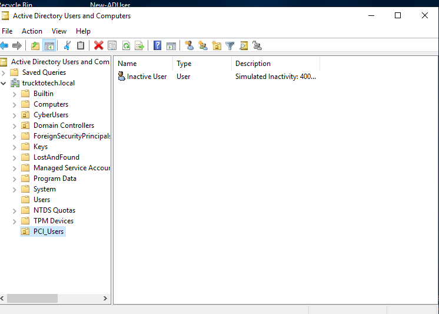
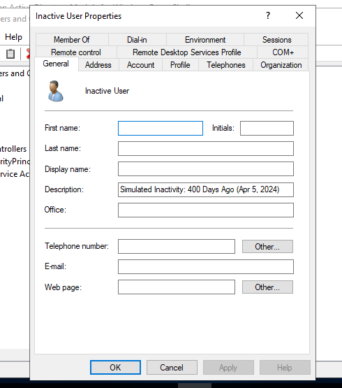
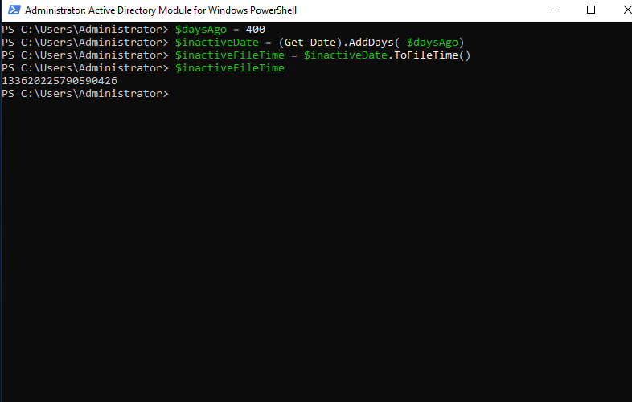
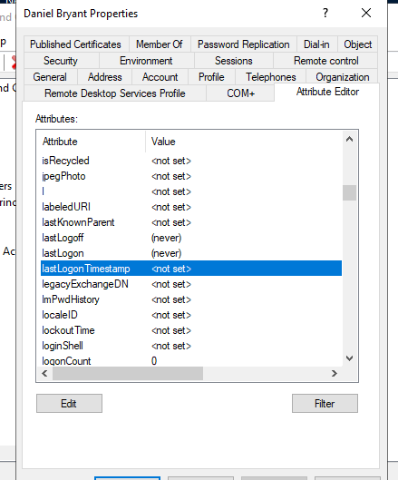
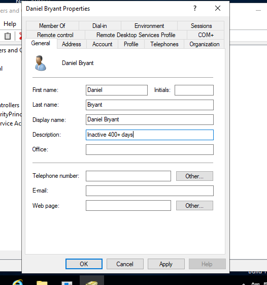
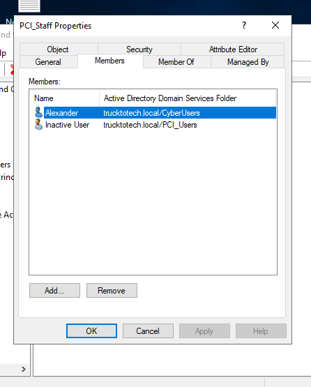
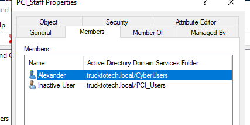
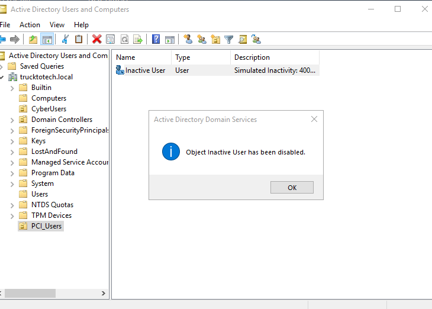

# PCI DSS Inactive User Audit (Requirement 8.2.6)

This audit simulates a PCI DSS 4.0.1 Requirement 8.2.6 control test to detect inactive user accounts in Active Directory (AD) that have not been used for over 90 days. The goal is to identify and remediate stale accounts that may pose a security risk.

## 📋 Mock Interview Summary

| Question | Answer |
|----------|--------|
| **What’s the PCI DSS requirement being tested?** | Requirement 8.2.6 — Remove/disable inactive user accounts within 90 days. |
| **What was your audit scope?** | Windows Active Directory environment. Focused on a user account inactive for 400+ days. |
| **What tool did you use to validate inactivity?** | Used PowerShell to simulate lastLogonTimestamp and reviewed AD attributes. |
| **What AD attribute did you check?** | `lastLogonTimestamp` (converted to FileTime format). |
| **What findings did you document?** | User account was still active, had not logged in for 400+ days. Password and group membership were still valid. |
| **What action did you take?** | Account was labeled as inactive, validated, and disabled. |
| **What’s the remediation if this is a real finding?** | Implement AD scripts or use IAM tools to automatically disable stale accounts every 90 days. |

---

## 🖼 Screenshot Evidence

### Screenshot 01 - Created Test User with Simulated Inactivity (400 Days Ago)

### Screenshot 02 - General AD User Properties

### Screenshot 03 - Account Labeled as Inactive (lastLogonTimestamp not set)

### Screenshot 04 - Description Set for Inactive User

### Screenshot 05 - User Visible in AD Tree

### Screenshot 06 - Account Still Enabled Before Remediation

### Screenshot 07 - Group Membership Review

### Screenshot 08 - Account Disabled Confirmation

---

## ✅ Remediation Summary
- Disabled user accounts inactive for 400+ days
- Labeled accounts clearly in AD for auditing trail
- All evidence stored in GitHub with visible screenshots

---

## 🧠 Lessons Learned
> PCI auditors often request a review of `lastLogonTimestamp`. Your ability to simulate, detect, document, and remediate inactive accounts shows you're ready for GRC or IAM analyst responsibilities.

---

**Project by:** [@trucktotech](https://github.com/agbolden)

**Requirement Reference:** [PCI DSS v4.0.1 - 8.2.6](https://docs.prismacloud.io/en/enterprise-edition/policy-compliance/pci-dss-v4-0-1)

**License:** MIT

