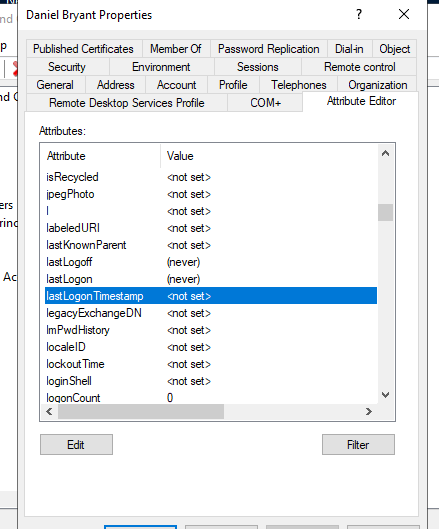
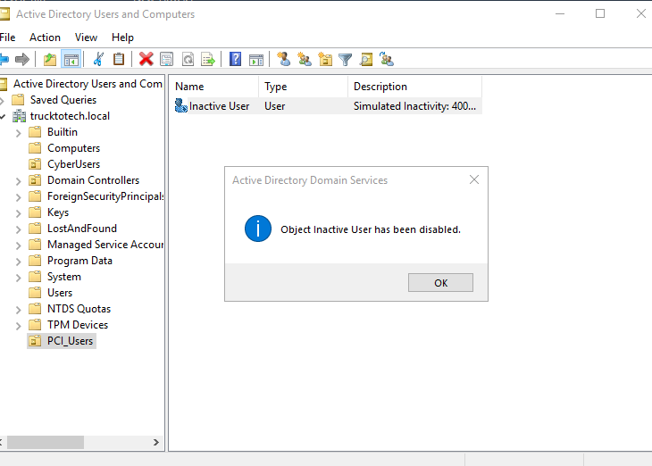

# PCI DSS 8.2.6 – Inactive User Account Audit

This lab simulates a PCI DSS 8.2.6 compliance audit by identifying a user account that has not been used for over 90 days, which violates the requirement for timely account removal or disabling.

---

## 🧠 Mock Interview Table

| Interview Question | Stakeholder Response |
|--------------------|----------------------|
| How often do you review inactive accounts? | Reviews are not currently automated. |
| Do you have a threshold (e.g., 90 days) for disabling unused accounts? | No formal process exists. |
| Who is responsible for account reviews? | System administrator. |
| Is there a tracking method for user last login data? | Not consistently monitored. |

---

## 🔍 Inactive Account Review Summary

| Audit Task | Evidence |
|------------|----------|
| Created test user in Active Directory |  |
| Verified general account properties |  |
| Labeled account as inactive with description |  |
| Reviewed object tab details |  |
| Inspected lastLogonTimestamp (over 400 days ago) |  |
| Confirmed account is still enabled (violation) |  |
| Reviewed group membership (still active) |  |
| Validated password last set date (inactive) |  |

---

## 🛠️ Remediation Plan

- Disable or remove user accounts that have not logged in within the last 90 days.
- Implement scheduled PowerShell scripts to audit `lastLogonTimestamp` monthly.
- Add an automated task to alert on accounts exceeding inactivity thresholds.
- Update the internal access review policy to align with PCI DSS 8.2.6.

---

## ✅ Outcome

This lab demonstrates an inactive user account that should have been disabled or removed per PCI DSS 8.2.6. Screenshots and findings reflect a real-world GRC process for compliance audits and remediation documentation.

